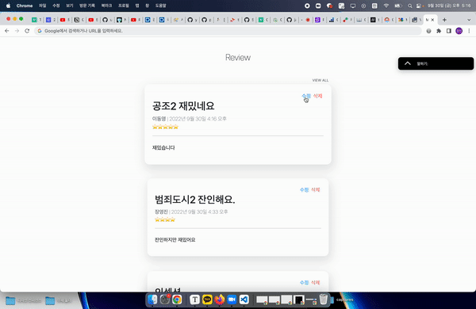

# 2022-09-30 페어프로젝트

## 프로젝트 내용

`Back-end` : 이동영

`Front-end` : 장영진

---

영화 리뷰 커뮤니티 서비스의 CRUD기능과 페이지를 구현

 

### 모델 Model

| 이름       | 역할     | 필드     | 속성                     |
| ---------- | -------- | -------- | ------------------------ |
| title      | 제목     | Char     | max_length=80            |
| content    | 내용     | Text     |                          |
| created_at | 생성시간 | DateTime | auto_now_add=True        |
| updated_at | 수정시간 | DateTime | auto_now=True            |
| score      | 평점     | Char     | null=True, max_length=5  |
| writer     | 작성자   | Char     | null=True, max_length=10 |

 

### 기능 View

- index : 작성된 모든 리뷰 출력 `관리자 관점`
- created : 리뷰 작성페이지 출력
- write : 리뷰 작성
- detail : 해당 pk 리뷰 보기
- details : 작성된 모든 리뷰 출력 `유저 메인화면`
- edit : 해당 pk 리뷰 수정 페이지 출력
- update : 리뷰 수정
- delete : 해당 pk 리뷰 삭제

 

### 화면 Template

- details : 유저 관점 메인 페이지
  - 생성, 조회, 수정, 삭제 가능
- index : 관리자 관점 메인 페이지
  - 생성, 조회, 수정, 삭제 가능
- detail : 해당 pk 리뷰 보기
  - 조회, 삭제 가능
  - 수정 페이지로 연결
- edit : 해당 pk 리뷰 수정
  - 조회, 수정 가능
- create : 리뷰 작성 페이지
  - 생성 가능
